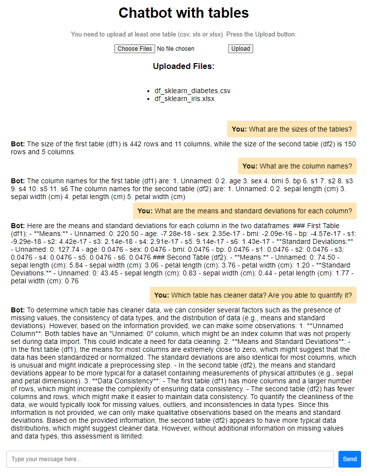

## Development Environment

- Windows 11 Pro
- VSCode 1.93.1
- WSL2 with Ubuntu
- Python 3.10.12
- Python packages managed with [uv](https://github.com/astral-sh/uv)

Work with Windows+WSL2, Linux directly, or macOS.

First, clone this repo:
```
git clone https://github.com/wiktorolszowy/chatbot-with-tables.git
```

If you want to use a local language model, pull/download the llama 3.1 model (now anyway OpenAI API is used). Run once.
```
curl -fsSL https://ollama.com/install.sh | sh
ollama pull llama3.1
```

Install python and uv. Run once.
```
sudo apt update
sudo apt install -y python3.10 python3-pip

sudo apt install -y pipx
pipx install uv
```

Create a `venv`. Install dependencies. Install pre-commit. Update uv lock. Good to re-run sometimes (to get a clean `venv`).
```
uv venv
source .venv/bin/activate
uv pip install -r pyproject.toml

pre-commit install

uv lock
```

Activate the environment and run python.
```
source .venv/bin/activate
uv run python
```

You need to create file `config.env` (at the root) and put your OpenAI API key there: `OPENAI_API_KEY=...` Be careful who has access to it!
Wiktor uses his own key and `.gitignore` covers `config.env`. You need to create file `config.env` by yourself.
And you need to use your own OpenAI API key.

For the flask app we need an available port. Identify the PIDs of processes that use this port and kill them before
running the app. Be careful that you do not kill something that you need!
Run the lsof command and note the PIDs of the processes using the port. Kill each process: use the kill command to
terminate each process by its PID. The flask app uses port 5000.
```
lsof -i :5000
kill -9 {PID}
```

Run the flask app:
```
uv run python app.py
```

Remember that in ```uv```-managed environments, many commands need to be started with ```uv```, e.g., ```uv pip list```.

It is tricky to track changes in notebook files, e.g., with `git diff`.
Furthermore, we do not want to have cell outputs on the remote (because there could be confidential data there).
`.ipynb` files are ignored by git (cf. our ```.gitignore```), so we are tracking the corresponding `.py` file of the `.ipynb` file.
To get the `.ipynb` file from the `.py` file, run ```jupytext --to ipynb test_table_bot.py```.

### Suggested VSCode Extensions

Ideally, install the following VSCode extensions:

- Python
- Git Graph
- Git History
- Git Blame
- Flake8
- Black
- isort
- Ruff
- Pylint
- GitHub Copilot
- Jupytext for Notebooks (congyiwu)
- Snyk Security
- SonarLint

## Using the chatbot with a Docker container

In case you want to work with the chatbot based on the Docker image.

First, clone this repo:
```
git clone https://github.com/wiktorolszowy/chatbot-with-tables.git
```
Build the Docker image (from the root of the repo):
```
docker build -t chatbot-with-tables .
```
and then run the Docker container:
```
docker run -p 5000:5000 chatbot-with-tables
```
If there are port problems, look above.

## Safety

We have to be very careful with security aspects, especially when working with packages like langchain [(why langchain is risky?)](https://www.thoughtworks.com/radar/languages-and-frameworks/summary/langchain). ```langchain_experimental``` is dangerous to run, especially when using ```allow_dangerous_code=True```.

While working in VSCode, install the ```Snyk Security``` extension (look above). Wiktor uses only the free tier features, like open source vulnerability scans. In this extension you need to login to Snyk, e.g., with GitHub authorization. On the Snyk website, you need to add our GitHub repo (under ```Projects``` tab). Wiktor did it for himself. Not sure how to manage groups/teams on the free tier. Not sure if the online dashboard shows more than what is shown in the VSCode extension.

Wiktor does not understand why the dependencies are not read from ```pyproject.toml```. Maybe because the versions are not given there. Snyk seems to have problems identifying the package versions from ```uv.lock```. Maybe there are some settings Wiktor missed. For now, Wiktor is running ```uv pip list > requirements.txt```. Importantly, this file is not used to install dependencies, but for Snyk to do checks on the dependency versions that we are using.

Surprisingly, ```langchain_experimental``` does not seem to be considered a vulnerability by Snyk.

## To Do (if the project continues)

- Make a sandboxed EC2 instance, e.g., limiting/removing the outbound traffic. Wiktor has already set up an EC2 instance for this work, though he faces some connectivity issues: the connection sometimes drops and it is not that easy to restore it. It seems to be linked to increased inbound traffic. Wiktor did not have time to investigate it properly. Disabling firewall did not help. The easiest fix was to stop and start the instance after each connection drop. However, this was changing the public IP address (and so the public DNS address, so the config file needed to be changed each time). Wiktor used ssh, not ssm, so that the instance could be accessed just with the .pem key - this way the ec2 instance could be used by someone without an aws account, which would be great. It seems ssm cannot work with .pem key only.
- Test different language models. The current solution relies on llama3.1 or GPT-4o. However, consider data confidentiality constraints of using non-local models (like GPT-4o).
- Perform prompt engineering, e.g., with [dspy](https://github.com/stanfordnlp/dspy).
- If fine-tuning needed, start using [MLflow](https://github.com/mlflow/mlflow), in order to track experiments.
- Use GitHub Actions together with a CI/CD pipeline covering at least some basic tests.
- Decrease the response latency. This will not be that easy, because the agent is effectively initialized again each time a dataset is added (importantly, we are saving the chat history and we are adding it to the questions). Moreover, the chatbot relies on a Python REPL tool, which executes Python code. That takes some time.